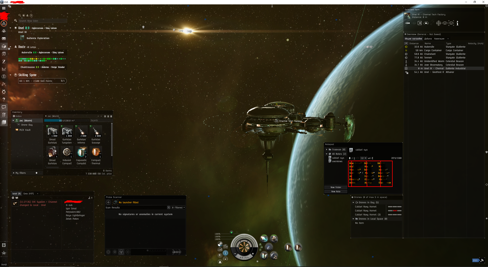

# Первая версия бота для игры EVE Online

## особенности
- для реализации функционала пиксель хантинга использовал библиотеку opencv2, 
- функционал распознавания текста (Tesseract OCR) и нечеткого сравнения строк (fuzzywuzzy)
- 2 первых пункта должны обеспечивать надежность от автобана: сочетание opencv2 OCR fuzzywuzzy является самым беспалевным способом чтения информации с окна игры.
- управление в игре обеспечивается с помощью WinApi, 
- умеет читать изображения (делать скрины) в неактивном окне, также и эмулировать нажатия клавиш, то есть во время работы бота можно альтабаться (сворачивать окно игры нельзя).
- следит за хп дронов
- имеется автопилот
- в качестве корабля подходит любая дроновозка, в идеале это worm или gila

## из минусов
- сложность в настройке бота: нужно проверить 43 переменных в конфиге, которые отвечают за расположение окон и других элементов в интерфейсе игры.
- OCR и fuzzywuzzy может не всегда правильно читать текст, а обработка изображения в opencv2 может не всегда правильно срабатывать из-за чего могут быть ошибки в процессе работы бота.

## настройка и запуск
1) ну как минимум поменять значения переменных в config.py
2) в настройках графики выставить оконный режим
3) примерное расположение окон в игре:

4) запустить bot.py